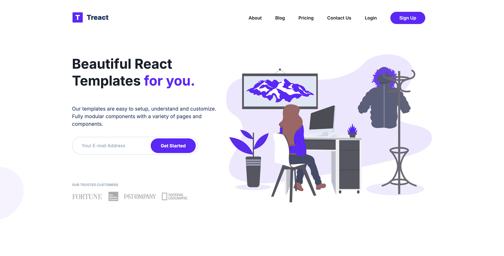

# Treact Replica Site Project



In this project, I built a replica webpage of this [Treact template](https://treact.owaiskhan.me/components/landingPages/SaaSProductLandingPage). 

## Prerequisites

1. A modern browser (Examples- Chrome, Firefox, Safari)
2. VS Code or another editor
3. Git (Optional)
4. Live Server extension on VS Code or a similar one to open the webpage

## Open and View Webpage

Right-click `index.html` and select 'Open with Live Server' or type `Cmd + L` and `Cmd + O`. For Windows `Alt + L` and `Alt + O`

``` ```

## Structure and Design

Using the basics of HTML and CSS learned in this course so far, I structured the website into ten parts - nine `sections` and the `footer`.  The flexbox layout method was used extensively for robust responsive design, making the website accessible on various screen sizes. While building later sections of the site, patterns began to emerge and I reused code in some instances. I also grouped CSS selectors that had the same properties, in an effort to follow the DRY (Don't Repeat Yourself) principle.

## Additional Tools and Uses

I used Github Copilot and FES's Duck to answer questions about concepts where I needed more help understanding or building out code, mostly in the non-required FAQs section. For example, Copilot helped build the sliding testimonials, using what I had started with, one complete static testimonial. It was also helpful in explaining and creating the `details` and `summary` elements and the built in functionality to hide and reveal the answers in the FAQs.

## Lessons and Next Steps

Following this project, I have a much better understanding of HTML, CSS, and Flexbox. I also became more adept at inspecting and understanding the DOM (Document Object Model) in the browser while working with the Treact template. After seeing the extensive CSS code used to slide the testimonials, I am looking forward to how JavaScript can implement the same feature in fewer lines of code, as well as seeing how JS will further enhance a website's capabilities. 


